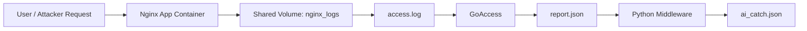

# GSLC SNA Group 7 -- Static Dashboard Pipeline

## Project Overview / Ringkasan Proyek

This project is a Dockerized React/Vite dashboard extended with a log-analysis pipeline using Nginx, GoAccess, and a Python middleware.

Proyek ini merupakan dashboard React/Vite yang dijalankan melalui Docker dan dilengkapi dengan pipeline analisis log menggunakan Nginx, GoAccess, dan middleware Python.

## Architecture / Arsitektur

- The `app` service builds the React/Vite frontend and serves it through Nginx.
- Layanan `app` membangun frontend React/Vite dan menampilkannya melalui Nginx.
- Nginx writes access logs to the shared `nginx_logs/` volume.
- Nginx menulis access log ke volume bersama `nginx_logs/`.
- `goaccess` reads `nginx_logs/access.log` and generates `nginx_logs/report.json`.
- `goaccess` membaca `nginx_logs/access.log` dan menghasilkan `nginx_logs/report.json`.
- `src/scenario_filter.py` monitors `report.json` and writes `ai_catch.json` when anomalies are detected.
- `src/scenario_filter.py` memantau `report.json` dan menulis `ai_catch.json` ketika anomali terdeteksi.

## Run the Project / Menjalankan Proyek

Start the full stack:

Menjalankan seluruh stack:

```bash
docker compose up --build
```

Run it in the background:

Menjalankan di latar belakang:

```bash
docker compose up -d --build
```

## Access the Application / Mengakses Aplikasi

Open your browser and visit:

Buka browser dan akses:

```text
http://localhost:3000
```

## Stop the Containers / Menghentikan Container

```bash
docker compose down
```

## Important Files / File Penting

- `compose.yaml` for container orchestration.
- `compose.yaml` untuk orkestrasi container.
- `Dockerfile` for the frontend build and Nginx runtime image.
- `Dockerfile` untuk build frontend dan image runtime Nginx.
- `nginx/nginx.conf` and `nginx/default.conf` for logging and server settings.
- `nginx/nginx.conf` dan `nginx/default.conf` untuk pengaturan logging dan server.
- `goaccess.conf` for log parsing rules.
- `goaccess.conf` untuk aturan parsing log.
- `src/scenario_filter.py` for anomaly detection and alert generation.
- `src/scenario_filter.py` untuk deteksi anomali dan pembuatan alert.

## Data Flow / Alur Data



Before GoAccess, the flow stops at `access.log`. After GoAccess and the middleware, the pipeline produces `report.json` and `ai_catch.json`.

Sebelum GoAccess, alur berhenti di `access.log`. Setelah GoAccess dan middleware, pipeline menghasilkan `report.json` dan `ai_catch.json`.

## Team Members / Anggota Kelompok

- Alexander Bagus Wijanarko - 2802407824
- Kyoshiro Kaynelie - 2802407553
- Mikhael Filemon - 2802471221
